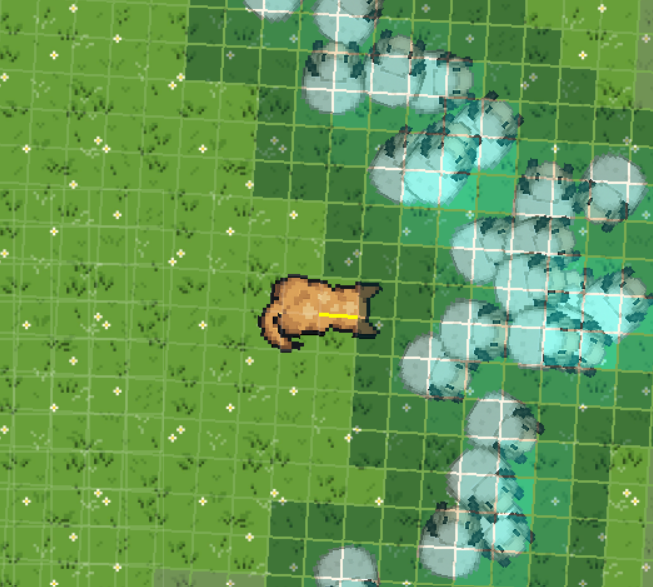

# Sheep Herding RL — Hackathon Quickstart
In today's hackathon, your goal is to train two competing reinforcement learning agents (the dog and the wolf) in a sheep herding simulation.

- The dog's objective is to herd as many sheep as possible into the safety pen on the right side of the screen
- The wolf's objective is to disrupt the dog and eat as many sheep as possible

Next, you’ll find a quick start guide to get your training environment up and running.

## What you edit (only these files)
- `ppo_train.py`
- `sac_train.py`

Note: or you can implement train functions yourself, but refer to ppo_train or sac_train to see how to use a simulator API.

Inside each script you can:
- Change the neural networks (Actor/Critic) classes.
- Implement the reward functions for the dog and wolf.
- Tweak hyperparameters and training settings.

The simulation itself lives in the packaged module `sheep_herding_rl` and is fixed for the event.


## Where to plug in your code

### 1) Neural networks (Actors/Critics)
Each training file has example networks you can change freely:
- `sac_train.py`: classes `Actor` and `CriticQ` (twin Qs)
- `ppo_train.py`: classes `Actor` and `Critic`

Contract (keep shapes consistent):
- Actor input: `(obs_grid: (B, C, H, W), pen_vec: (B,2))` → action or dist params
- Critic/Q input: `(obs_grid, pen_vec, action)` → scalar value/Q

Tips:
- Start small (e.g., 32–64 conv channels, 128–384 MLP width).
- Use ReLU/Tanh/LayerNorm as you like, but keep output heads unchanged.


### 2) Reward functions (dog and wolf)
You own two functions per script:
- `dog_reward_fn(info, prev_info)`
- `wolf_reward_fn(info, prev_info)`

Both receive a rich `info` dict each step, and `prev_info` from the prior step so you can reward improvements. Common keys you’ll use:
- `sheep_entered_pen`, `sheep_eaten`
- `wolf_killed`, `wolf_is_dead`, `wolf_just_ate`
- `sheep_remaining`, `total_sheep_in_pen`
- `dog_position`, `wolf_position`, `sheep_positions`
- `pen_center`

Simple starting points:
- Dog: +100 per sheep entering, −100 per sheep eaten, tiny shaping toward pen.
- Wolf: +100 per sheep eaten, small penalty when sheep enter pen, tiny shaping to move toward nearest sheep.

Concrete example for the wolf:
```py
def wolf_reward_fn(info, prev_info=None) -> float:
    """Wolf: eat sheep; avoid the dog. Add shaping so learning isn't stalled."""
    reward = 0.0

    # Sparse main objective
    reward += float(info.get("sheep_eaten", 0)) * 100.0

    # Survival penalty
    if info.get("wolf_killed", False):
        reward -= 100.0

    # Dense shaping: move toward nearest sheep
    sheep_positions = info.get("sheep_positions", None)
    wolf_pos = info.get("wolf_position", None)
    if (sheep_positions is not None) and \ 
       (wolf_pos is not None) and \
       (len(sheep_positions) > 0) and \ 
       (not info.get("wolf_killed", False)):

        dists = np.linalg.norm(sheep_positions - wolf_pos, axis=1)
        min_dist = float(np.min(dists))
        reward += (1.0 - min(min_dist / 600.0, 1.0)) * 0.3

    return reward
```

Hooking them up to the simulator:
- In `ppo_train.py` they’re already passed:
  - `simulator = Simulator(dog_reward_fn=dog_reward_fn, wolf_reward_fn=wolf_reward_fn, ...)`
- In `sac_train.py`, do the same if you want to override defaults:
  - `simulator = Simulator(dog_reward_fn=dog_reward_fn, wolf_reward_fn=wolf_reward_fn, headless=HEADLESS)`

## Tiny mental model

This short description shows what happens each simulation step and how agents, rewards
and observations flow between the agents and the simulator. Read the numbered steps
for a plain-text view, or see the sequence diagram below.

1. Each agent (Dog and Wolf) computes an action from its current observation and the
  pen-vector (act(obs, pen_vec)).
2. The Simulator steps forward using both actions and updates the environment state.
3. The Simulator computes rewards by calling the configured reward functions
  (dog_reward_fn and wolf_reward_fn), which receive `info` and `prev_info`.
4. The Simulator returns next observations (and the pen vector) to each agent.
5. Agents store the transition (obs, action, reward, next_obs) in memory and learn
  later (on-policy or via replay buffers for off-policy methods).


## How to run
- Start one of the training scripts either from the console or in visual studio, this will open a black window
- To toggle displaying the simulation, press H, this will turn rendering on and off, You should keep it off while training to speed it up, and turn it on when you want to see the progress.

From your environment:
- PPO: run `ppo_train.py`
- SAC: run `sac_train.py`


## Cheat sheet: PPO vs SAC vs
- PPO (on-policy)
  - Buffers entire episodes, then updates K epochs with clipped objective.
  - Good baseline. Slower sample reuse, but stable.
  - Actor output: stochastic (e.g., Beta in this repo), exploration built-in.
- SAC (off-policy)
  - Replay buffer + entropy bonus (temperature α).
  - Stochastic tanh-Gaussian policy; usually data-efficient and robust.
  - Critic uses twin Qs and target nets.

Tuning pointers:
- Batch size: 64–256 works well.
- Learning rate: start at 3e-4 (SAC/PPO critics/actors).
- Replay capacity (off-policy): 200k–500k; warmup ~10k steps.
- Keep your shaping small so sparse goals dominate (e.g., 50–150 major, 0.001–0.2 tiny per-step).


## What the observations look like
- Grid shape is 3×20×20 in the agent’s local frame.
  - channel 0: other agent - dog sees wolf; wolf sees dog
  - channel 1: sheep density - for each sheep position, a gaussian is placed on top of it, and if multiple sheep are in the same position, the value will be greater there
  - channel 2: walls/bounds - just a 0 or 1 value for every pixel, weather a wall is there or not, this way the agents can learn to not just go straight into a wall
- Metadata vector (2D): direction from agent to the pen entrance, in local frame.



You’ll see example encoders in each script; follow that pattern.


## Example of dog herding sheep


The wolf sees very few sheep at any given time, which makes it really hard to learn a good policy (way of acting) which will "think" to push all the sheep in.

## Example of wolf killing sheep


The wold is much easier to train, as it just needs to go toward a sheep to eat it, and possibly avoid the dog if the reward function is shaped that way.

## Quick success checklist
- Edit your Actor/Critic without changing their input/output contracts.
- Implement both `dog_reward_fn` and `wolf_reward_fn`.
- Run a few (30-50 at least) episodes and watch average rewards move the right way.
